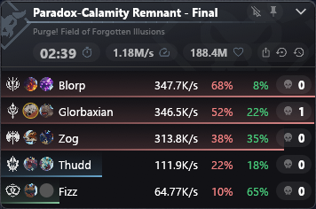

# ShinraMeter-BPSR

A damage meter overlay for **Blue Protocol: Star Resonance**. It's a small,
borderless, always-on-top window that sits over the game and shows
per-player damage totals, DPS, contribution %, crit rate, and hit count for
the current fight — styled after the classic ShinraMeter.

It reads game network traffic passively to build these stats. It does not
modify the game client, inject code, or interact with the game process in
any way.



*Captured in demo mode (`SHINRA_DEMO=1`), which seeds a fixed synthetic
encounter — the names and figures shown are not from a real parse.*

## Download

1. Go to the [latest release](https://github.com/NguyenJus/ShinraMeter-BPSR/releases/latest).
2. Download the `.zip` asset and extract it somewhere on your PC. The zip
   contains the executable only — every icon set, including the class and
   Imagine icons, is compiled into the executable, so there is nothing else
   to extract or keep beside it.
3. Double-click `ShinraMeter-BPSR.exe`.
4. Windows will show a UAC prompt asking to run as Administrator. Accept it
   — the meter needs elevation to install its packet-capture driver (see
   [Prerequisites](#prerequisites)).
5. Launch Blue Protocol: Star Resonance and get into combat. Damage rows
   should start appearing within a few seconds of the fight starting.

That's it — no separate driver download, no installer, nothing else to set up.

## Prerequisites

- **Windows.** The meter only runs on Windows; there is no macOS or Linux build.
- **Administrator / a UAC prompt on launch.** The executable's manifest
  requests `requireAdministrator`, so Windows always prompts for elevation
  when you start it. This is required because the meter installs a
  kernel-level packet-capture driver ([WinDivert](https://reqrypt.org/wdivert.html))
  through the Windows Service Control Manager, which only administrators can do.
- **Nothing to install separately for packet capture.** Unlike some other
  meters, you do not need to install Npcap or WinPcap yourself. The
  WinDivert driver is bundled inside the executable and unpacked
  automatically to `%LOCALAPPDATA%\ShinraMeter-BPSR\windivert\<version>\` the
  first time you run it.
- **Antivirus/VPN software that may interfere.** Some antivirus tools, VPN
  filter drivers, or Windows Core Isolation settings can block the
  WinDivert driver from loading. NordVPN and Brave's built-in VPN are known
  to conflict. See [Troubleshooting](#troubleshooting) below.

## Using it

The overlay is a transparent, undecorated window that floats above the
game, always on top. A few things to know:

- **Move it**: click and drag the window to reposition it. Its position is
  remembered between runs.
- **Toolbar buttons**: the header has icons for taking a screenshot (copies
  the current overlay to your clipboard), resetting the current encounter,
  opening settings, and closing the meter.
- **Settings**: the gear icon opens a "Columns" panel where you can toggle
  which stat columns are shown (Ability Score, Season Strength, Damage,
  DPS, Share %, Crit %, Lucky %, Hits, Deaths). Your choices are saved
  automatically.
- **Data location**: settings are stored in
  `%APPDATA%\ShinraMeter-BPSR\settings.json`, and logs in
  `%APPDATA%\ShinraMeter-BPSR\logs\ShinraMeter-BPSR.log`.
- All icons — class, Imagine, and toolbar — are compiled into the
  executable, so there's no `assets` folder shipped alongside it to lose,
  delete, or otherwise manage.

## Troubleshooting

The overlay's status banner names the specific failure it hit — read that
message first, since each of these has a different fix.

**"Windows blocked the WinDivert driver"** — antivirus, a VPN filter, or
Core Isolation / Memory Integrity vetoed the driver. NordVPN and Brave are
known conflicts; close them and retry, or check Windows Security → Device
security → Core isolation.

**"A different version of the WinDivert driver is already loaded"** —
another packet-capture tool (or a previous meter version) already holds
WinDivert. Close it, or reboot, and retry.

**"The Base Filtering Engine service is disabled"** — start it via
`services.msc` → Base Filtering Engine → Start.

**"Windows could not find the WinDivert driver file"** — the driver is
unpacked to `%LOCALAPPDATA%\ShinraMeter-BPSR\windivert\<version>\` at
startup and wasn't found there. Check that antivirus isn't quarantining it,
then delete that folder to force a clean re-unpack.

**"Run as Administrator"** — the manifest normally triggers the UAC prompt
automatically; seeing this message means elevation was declined or
stripped. Right-click the exe → Run as administrator.

**Your antivirus flags the exe** — this happens sometimes with tools that
install a kernel driver and aren't code-signed by a large vendor. Only
download the executable from the official [Releases page](https://github.com/NguyenJus/ShinraMeter-BPSR/releases/latest)
of this repository.

**No damage data appears**:
1. Make sure you're logged into the game and actually in combat.
2. Check the overlay's status line for an error message.
3. Restart the meter and try again.
4. If it persists, it may be failing to detect the game server on your
   connection — please file an issue with your setup details (see below).

## Disclaimer

ShinraMeter-BPSR is an unofficial, third-party tool. It is **not affiliated
with, endorsed by, or sponsored by** the developer or publisher of Blue
Protocol: Star Resonance. All game names, images, and data referenced
belong to their respective owners.

The meter works by passively reading network traffic between your PC and
the game server — it does not modify the game client, inject into its
process, or send any packets of its own. That said, using third-party
tools alongside any online game carries some inherent risk. Use it at your
own risk and in accordance with the game's terms of service.

If you're a rights holder and want assets removed, see the License section
below.

## License

This project is licensed under the GNU General Public License v3.0
(GPL-3.0-only). That license covers the code in this repository. It does not
cover, and does not purport to cover, the game-client-derived assets
described in [`THIRD_PARTY_NOTICES.md`](THIRD_PARTY_NOTICES.md) (the class
icons and Imagine icons under `crates/app/assets/`, and the Imagine
id/name table) — those remain the property of their respective owners and
are redistributed here only on the inferred basis explained there, not
under a grant from this project.

Those assets will be removed promptly on request from the rights holder — a
source deletion and rebuild, since they are compiled into the executable
(issue #123), followed by a re-release. To request removal, open a GitHub
issue on this repository.

Ported packet-format knowledge from these open-source trackers (all GPL-compatible):
- https://github.com/Blue-Protocol-Source/BPSR-ZDPS
- https://github.com/winjwinj/bpsr-logs
- https://github.com/resonance-logs/resonance-logs

UI design inspiration from
[neowutran/ShinraMeter (`mvvm_refactor_wip` branch)](https://github.com/neowutran/ShinraMeter/tree/mvvm_refactor_wip).

<details>
<summary><strong>Building from source</strong></summary>

## Architecture

The pipeline flows: **protocol crate** (frame splitting, decompression,
protobuf decoding) → **capture crate** (WinDivert packet sniffing on
Windows, TCP reassembly, server detection) → **meter crate** (encounter
state machine, per-player stats, reset logic) → **app crate** (egui
overlay, channels, command dispatch).

```
┌─────────────────────────────────────────────────────────┐
│ ShinraMeter-BPSR (app)                                  │
│   egui overlay ◄─── Snapshot (dps, damage, player rows) │
│      │                                                   │
│      ├─ Pipeline (meter state, per-100ms snapshots)     │
│      │                                                   │
│      └─ bpsr-capture (WinDivert packet loop)            │
│           ├─ TCP reassembly (out-of-order, retransmits) │
│           ├─ Server detection (game signature scan)     │
│           └─ bpsr-protocol Decoder (frames → events)    │
│                                                          │
└─────────────────────────────────────────────────────────┘
```

### Prerequisites

On WSL (cross-compiling to Windows):

```sh
rustup target add x86_64-pc-windows-gnu
sudo apt-get install -y gcc-mingw-w64-x86-64 binutils-mingw-w64-x86-64
```

`bpsr-protocol`'s `zstd` dependency builds `zstd-sys` from C, and the `app` crate's `build.rs` shells out to `windres` (via `embed_resource`) to embed the UAC manifest — so without mingw, even `cargo check --target x86_64-pc-windows-gnu` fails.

### Compile

Type-check on the host (fast):

```sh
cargo check --workspace
```

Cross-compile type-check (requires mingw above):

```sh
cargo check --workspace --target x86_64-pc-windows-gnu
```

Full build for Windows:

```sh
cargo build --release --target x86_64-pc-windows-gnu
```

The binary lands at `target/x86_64-pc-windows-gnu/release/ShinraMeter-BPSR.exe`.

### Testing

Run all unit tests on the host:

```sh
cargo test --workspace
```

The `bpsr-protocol`, `bpsr-meter`, and `bpsr-capture` (tcp/detect) crates are fully testable on Linux; `ShinraMeter-BPSR` tests only pure formatting helpers.

### Updating the bundled WinDivert

The binaries live in `crates/capture/vendor/windivert/`, taken verbatim from the official [reqrypt.org](https://reqrypt.org/wdivert.html) x64 release — the driver cannot be rebuilt locally, since Windows only loads a kernel driver carrying a signature it trusts. To move to a new release, replace the three files there and bump `WINDIVERT_VERSION` in `crates/capture/src/driver.rs`, which is also the name of the unpack directory and so keeps the new copy clear of the old one.

### Dev environment variables

- `SHINRA_LOG_FILE` — override the log file path (falls back to
  `ShinraMeter-BPSR.log` in the working directory if `APPDATA` is unset,
  e.g. a non-Windows dev host).
- `RUST_LOG` — raise log verbosity, e.g. `RUST_LOG=debug`.
- `SHINRA_NO_COMPOSITION=1` — force the legacy (non-DirectComposition)
  overlay presentation path, useful on RDP sessions or virtualized GPUs
  where the transparent window fails to paint.
- `SHINRA_INSPECT` / `SHINRA_INSPECT_DUMP` — diagnostic packet-dump
  tooling used to confirm new protocol constants against live traffic; off
  by default. See `docs/packet-inspection.md`.
- `SHINRA_DEMO=1` — seed a fixed synthetic encounter for UI work when no
  live game session is available.

Logs and packet-inspection dumps may contain player names and other
identifying traffic — never attach one to an issue or PR; mint a minimal
synthetic repro instead.

See also `docs/ui-debugging.md` for the WSL-to-Windows UI debugging harness,
and `docs/replay-system-tests.md` for the synthetic-scenario system tests in
`crates/app/tests/`.

</details>
